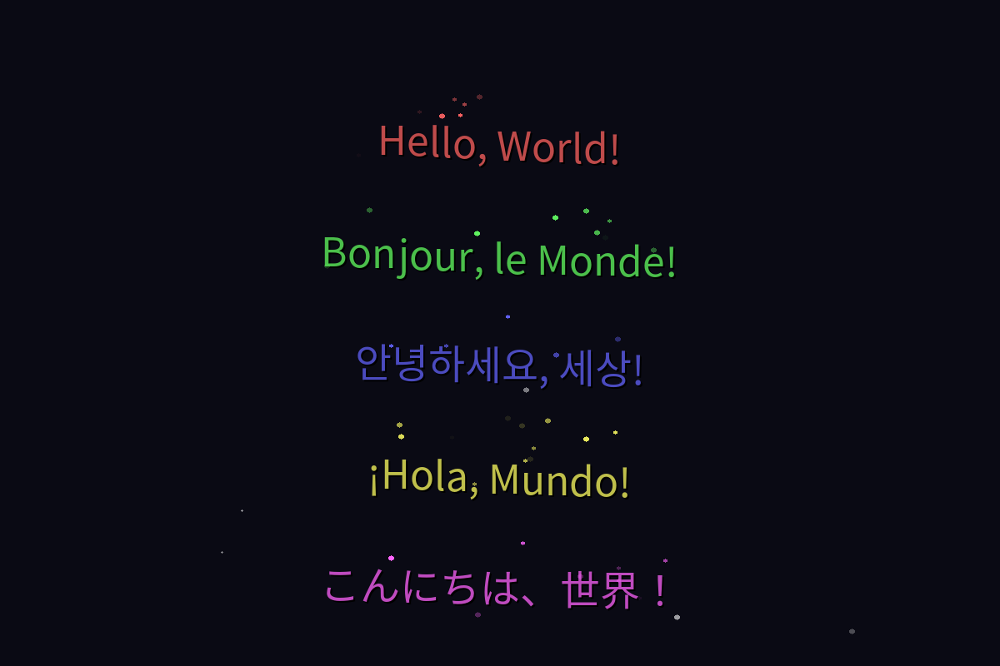

# 🌈 Animated Text Display


A stunning, multi-language text animation system with particle effects, smooth transitions, and beautiful visual effects. Perfect for creating eye-catching displays, presentations, or just for fun!

<div align="center">
  
</div>

## ✨ Features

### 🎨 Visual Effects
- ✨ Dynamic particle trails
- 🌊 Smooth wave animations
- 🎯 Multiple animation styles:
  - Wave
  - Bounce
  - Spiral
  - Shake
- 🌟 Starry background effects
- 🎭 Text shadows and glow

### 🌏 Language Support
- 🌐 Full Unicode support
- 🈺 CJK (Chinese, Japanese, Korean) characters
- 🎯 Auto-adjusting character spacing
- 📝 Sample texts in:
  - English: "Hello, World!"
  - French: "Bonjour, le Monde!"
  - Korean: "안녕하세요, 세상!"
  - Spanish: "¡Hola, Mundo!"
  - Japanese: "こんにちは、世界！"

### 🛠 Customization
- 🎮 Command-line interface
- 🎨 Multiple color schemes
- 📐 Adjustable animation parameters
- 🖼 Window size configuration

## 🚀 Quick Start

### Prerequisites
- Python 3.x
- Pygame
- Numpy
- CJK fonts (for Asian language support)

### Installation

1. Clone the repository
```bash
git clone https://github.com/yourusername/animated-text.git
cd animated-text
```

2. Install dependencies
```bash
pip install -r requirements.txt
```

3. For CJK support on Linux
```bash
sudo apt-get install fonts-noto-cjk
```

### Running the Animation

#### Basic Usage
```bash
python visual_hello.py
```

#### Custom Text
```bash
python visual_hello.py --text "Your" "Custom" "Text" "Here"
```

## 🎮 Controls

- `ESC` - Exit animation
- `Close Window` - Quit application

## 🎯 Examples

### Different Animation Effects
```bash
# Wave effect
python visual_hello.py --effect wave

# Spiral effect
python visual_hello.py --effect spiral

# Bounce effect
python visual_hello.py --effect bounce

# Shake effect
python visual_hello.py --effect shake
```

### Custom Colors
```bash
python visual_hello.py --text "Rainbow" "Colors" "Here"
```

## 📁 Project Structure

```
animated-text/
├── visual_hello.py     # Main Pygame implementation
├── hello_animation.py  # Original curses version
├── requirements.txt    # Dependencies
└── README.md          # Documentation
```

## 🤝 Contributing

Contributions are welcome! Feel free to:
1. Fork the repository
2. Create a new branch
3. Make your changes
4. Submit a pull request

## 📝 License

This project is licensed under the MIT License - see the LICENSE file for details.

## 🙏 Acknowledgments

- Pygame community for the excellent graphics library
- Noto fonts for CJK character support
- Python community for inspiration and support

---
<div align="center">
  Made with ❤️ by [Your Name]
</div>
